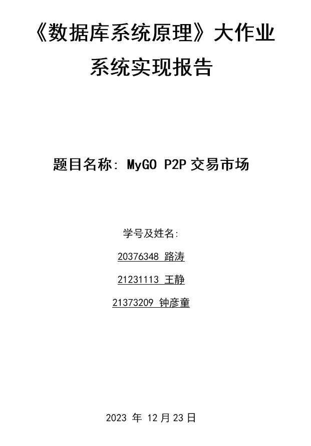
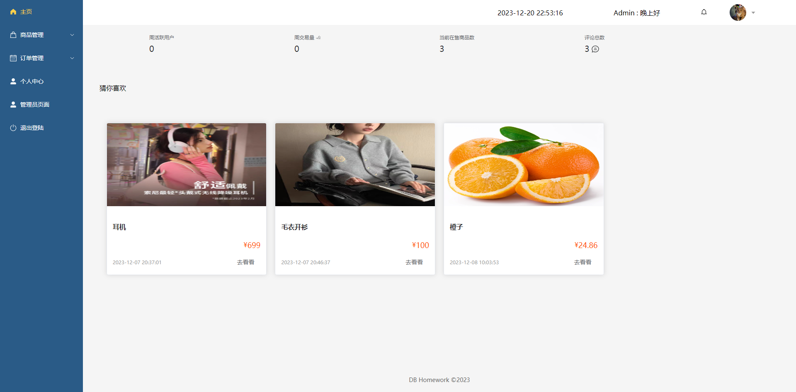
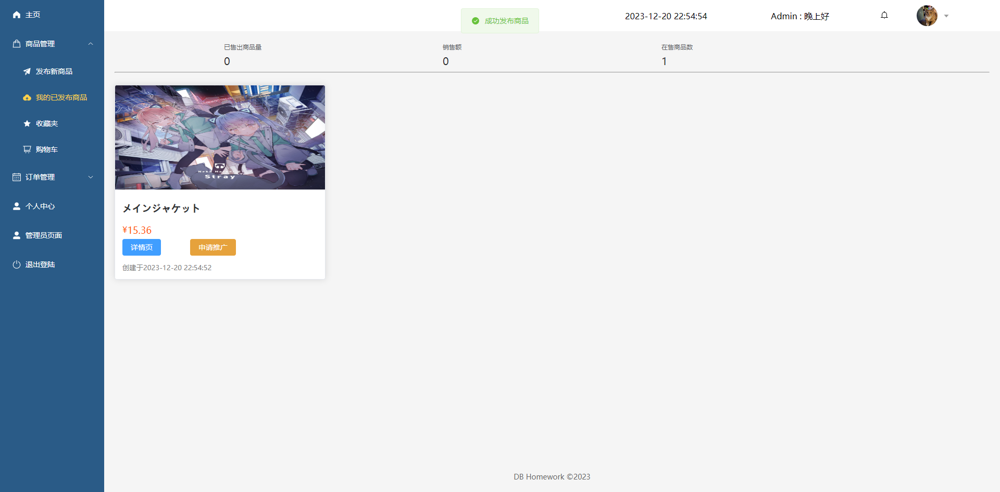
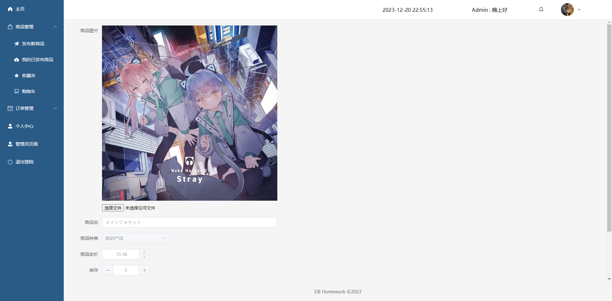
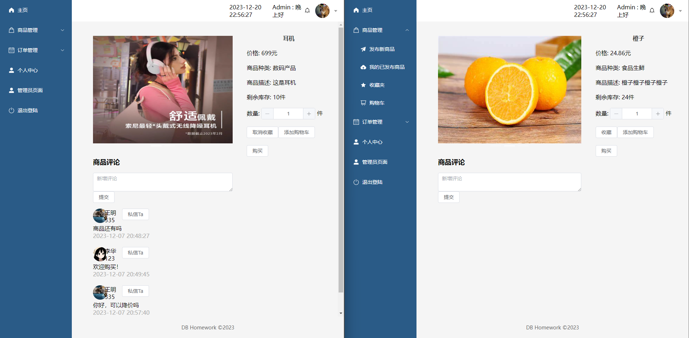
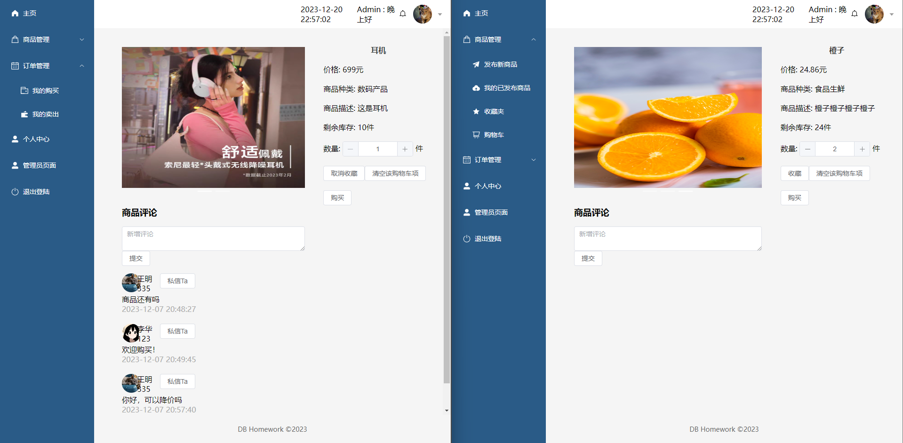
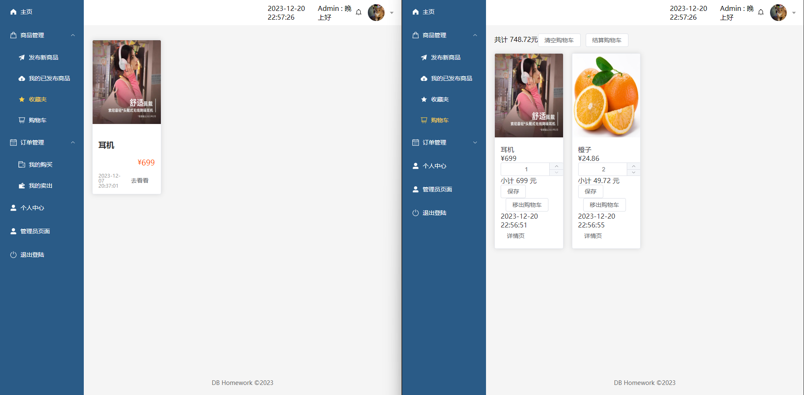
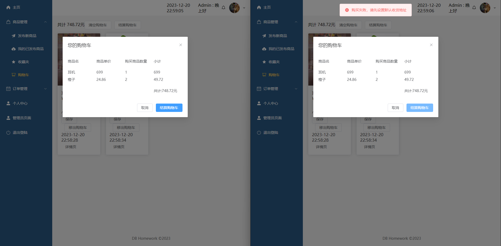
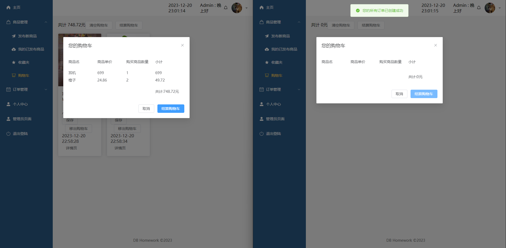

<div STYLE="page-break-after: always;"></div>

# 一、实现环境和部署方式

本系统是一个 Web 应用，利用 Vue3+Vite+Django 实现分离的前后端。

由于部分依赖的性质，该项目应当部署在全英文路径下。

### 前端

- 整体基于[Vue3](https://www.vue3js.cn/)开发

- UI基于[element-UI](https://element-plus.org/zh-CN/)

- 状态管理基于[Pinia](https://masteringpinia.com/?utm_source=vuerouter&utm_medium=website&utm_campaign=affiliate&utm_content=top_banner&banner_type=top&friend=VUEROUTER)

- 路由管理基于[Vue-router4](https://router.vuejs.org/zh/)

- 启动服务器

  node包管理工具使用pnpm。可以使用常见的npm代替。

  - 使用pnpm作为包管理工具时，通过`pnpm install`安装依赖，然后通过`pnpm dev`启动服务器。

  - 使用npm作为包管理工具时，通过`npm install`安装依赖，然后通过`npm run serve`或`npm run dev`启动服务器。

  默认启动在5173端口下。

### 后端

- 基于Django框架进行开发

- 运行环境：参考requirement.txt或下方

Python：3.11.5

```
asgiref==3.7.2
Django==4.2.7
django-cors-headers==4.3.1
djangorestframework==3.14.0
et-xmlfile==1.1.0
openpyxl==3.1.2
Pillow==10.1.0
PyJWT==2.8.0
pytz==2023.3.post1
sqlparse==0.4.4
tzdata==2023.3
xlrd==2.0.1
```

- 启动服务器

`pip install`安装依赖后，运行`python manage.py runserver`启动服务器。默认启动在8000端口下。

# 二、系统结构
## 2.1 前端
### 2.1.1 文件结构
```
.
├─api
├─assets
│  ├─login
│  ├─product
│  └─user
├─components
│  ├─layout
│  ├─message
│  ├─product
│  ├─promotion
│  ├─statistic
│  ├─timer
│  └─user
├─router
├─stores
│  └─modules
├─utils
└─views
    ├─admin
    │  ├─order
    │  └─user
    ├─home
    ├─layout
    ├─login
    ├─order
    ├─product
    └─user
```
除以下提到的文件外，其余文件均为脚手架生成的冗余文件

- src

  前端的源代码目录

  - api

    前端调用后端实现接口的相关函数。

  - assets

    项目静态文件的存储地址。包括用户和商品的默认头像，网页背景等图片

  - components

    该项目封装的Vue组件。项目依据组件化思想，将可能复用的网页元素模块化为组件并预留插槽，实现了封装

  - router

    路由相关。全局唯一实例化Router，进行配置后导出。全局依托此router设置进行url和页面的对应，并且全局可以导入router并使用路由相关功能。

  - stores

    状态管理相关。状态是pinia定义的概念。可以直观理解为通过调用接口获取的后端返回数据。这些数据被分门别类保存在modules文件夹下的对应文件中，并通过index.js文件统一导出。

  - utils

    工具文件夹。只存在request.js文件，它是对于请求和拦截的封装。项目通过axios发送ajax请求。该项目单独实例化一个新的axios实例并设置它的请求拦截和响应拦截器。在请求拦截中实现Token的附加。在响应拦截中处理是异常状态码的响应，并提示响应的错误信息。

  - views

    页面相关。每个vue文件作为一张网页，分门别类的被存储在各个子文件夹中。

  - App.vue

    Vue框架中挂载到index.html的vue文件。通过`<router-view>`导出当前路由对应的页面

  - main.js

    Vue框架中的入口文件，在此处进行挂载操作和pinia等一系列插件的导入使用。

- index.html

  被挂载的主页。Vue通过将App.vue挂载到该页面进行展示。

- package.json和pnpm-lock.yaml

  项目的依赖文件版本字典。类似于python项目的requirement.txt

- vite.config.js

  vite脚手架的设置。

### 2.1.2 运行流程

当在控制台执行`npm run serve`或`pnpm dev`时，会在src目录下找到main.js文件。

在main.js文件中，首先引入vue库，然后引入App组件作为所有其他组件的父组件。通过`app.mount('#app')`将App组件挂载到整个项目唯一的HTML页面index.html中。

接下来，我们进入App组件的文件App.vue。该文件由页面模板、页面脚本和页面样式组成。在App.vue中，通过`<router-view>`标签来展示当前路由对应的页面。

## 2.2 后端

### 2.2.1 文件结构

采用django实现。文件结构如下：

* app

  * migrations

    django生成的数据库迁移代码，用于修改模型类后将修改执行到数据库

  * models.py

    定义了模型类，对应数据库的表

  * urls.py

    定义路由，通过设置该文件的路由，将不同的请求发送到不同的视图函数中进行处理

  * utils.py

    定义一些工具函数，处理常用操作如token生成等

* views

  存放视图函数，用于处理前端发送的请求

  * User.py

    用户相关视图函数

  * Product.py

    商品相关视图函数

  * Order.py

    订单相关视图函数

  * Message.py

    消息相关视图函数

  * Promotion.py

    推广相关视图函数

  * Statistic.py 

    统计相关视图函数

  * Administrator.py

    管理员相关视图函数

* backend

  后端基本文件，用于进行一些配置，主要由django框架生成

* manage.py

  脚本，用于数据库迁移等操作

### 2.2.2 运行流程

在控制台执行`python manage.py runserver`，对于request，会根据urls中的路由发送给`app/views`中相应的视图函数进行处理

## 2.3 主要功能
* 用户管理
  * 用户注册：允许新用户创建账户，以便在系统中享受更多功能和服务。
  * 用户登录：让用户通过输入用户名和密码，进入系统进行操作。
  * 用户信息修改：允许用户更新自己的个人资料。
  * 用户注销：提供给用户安全退出系统的功能，保护用户隐私。

* 商品管理
  * 商品发布：为商家提供发布新商品信息的渠道，以供用户浏览和购买。
  * 确定商品类型：帮助商家和管理员分类商品。
  * 商品修改：允许商家或管理员对商品信息进行编辑和更新。
  * 商品筛选：筛选符合一定条件的商品并展示。
  * 商品推荐：推荐商品，提高购物体验。

* 订单管理
  * 订单生成：当用户完成商品购买后，系统自动生成订单，记录购买信息。
  * 订单修改：允许用户或管理员对订单信息进行编辑和更新，以满足用户需求。
  * 订单查询：提供多种查询方式，方便用户和管理员查找订单信息。

* 用户交互
  * 评价：让用户对购买的商品进行评价，分享购物心得。
  * 留言：提供给用户互相留言的功能，增进用户间的沟通与交流。
  * 接收通知：接受系统通知和留言。

* 系统管理
  * 修改用户：允许特定管理员对用户进行编辑。
  * 修改订单：允许特定管理员对订单进行编辑。

## 2.4 系统功能结构图


# 三、表的定义
## 3.1 基本表，主码外码，完整性约束，索引

### 3.1.1 总览
基本表如下图。


### 3.1.2 表，主码，外码
各项数据类型见 3.1.1 图。
1. 用户 **users** (<u>name</u>, email, password, currentInfo, avatar_id, regieter_time);
> currentInfo: 收货信息外码  
> avatar_id: 图片外码  

2. 图片 **images** (<u>id</u>, img);

3. 收货信息 **adder_info** (<u>id</u>, name, phone, place, user_id);
> user_id: 用户外码  

4. 商品 **product** (<u>id</u>, product_name, description, sale, stock, publisher_id, product_type_id, post_time, price);
> publisher_id: 用户外码  
> product_type_id: 商品类别外码  

5. 商品类别 **product_type** (<u>id</u>, type, fatherType);
> fatherType: 类别外码  

6. 商品图 **product_images** (<u>id</u>, img_id, product_id);
> img_id: 图片外码  
> product_id: 商品外码  

7. 管理员 **app_administrator** (<u>id</u>, level, user_id);
> user_id: 用户外码  

8. 订单 **order** (<u>id</u>, number, create_time, buyer_id, product_id, receiver_name, receiver_phone, receiver_place, status, buyer_name, product_name, seller_name, price);
> buyer_id: 用户外码  
> product_id: 商品外码  
> status: 订单状态  

9. 购物车 **cart** (<u>id</u>, product_id, user_id, count, create_time);
> product_id: 商品外码  
> user_id: 用户外码  

10. 收藏 **favorite** (<u>id</u>, product_id, user_id);
> product_id: 商品外码  
> user_id: 用户外码  

11. 评论 **comment** (<u>id</u>, text, create_time, item_id, publisher_id);
> item_id: 商品外码  
> publisher_id: 用户外码  

12. 消息 **message** (<u>id</u>, senderName, recipientName, content, recipient_id, sender_id, status);
> recipient_id: 用户外码  
> sender_id: 用户外码  

13. 推广 **promotion** (<u>id</u>, length, is_checked, applicant_id, product_id, begin_time);
> applicant_id: 用户外码  
> product_id: 商品外码  

### 3.1.3 完整性约束

#### 前端

前端所做的完整性约束主要为表单字段的验证。当不通过验证时，不会向后端发送请求。

##### 用户相关

- 用户名约束

用户名必须为5-10位的字符。

- 密码非空约束

登陆密码不能非空。

- 邮箱正确性约束

用户注册时的邮箱必须为正确格式的邮箱（符合正则表达式`^[A-Za-z0-9\u4e00-\u9fa5]+@[a-zA-Z0-9_-]+(.[a-zA-Z0-9_-]+)+$`）

- 注册密码相同约束

注册时两次输入的密码必须相同

- 默认收货信息非空约束

当用户没有在用户中心设置自己的当前默认收货信息时，发生购买行为会弹出提示框要求用户设置自己的当前默认收货信息

##### 商品相关

- 商品数量约束

在购物车，商品详情中，对商品数量的选择不能超过选择商品的当前库存。到达最大时会禁止增加数量。且最低数量不能小于1。

#### 后端

##### 实体完整性

所有插入表格的数据主码中的属性不能为空。具体地，限制添加用户时用户名不能为空，其他数据在加入数据库时会自动添加自增的id，所以一定满足实体完整性。

##### 参照完整性

* 用户收货信息所属的用户名必须在用户表中
* 商品的发布者必须在用户表中
* 订单的买家和卖家必须在在用户表中或者为空值，订单的商品必须在商品表中
* 购物车中商品必须在商品表中，购物车所属于的用户必须在用户表中
* 收藏夹中商品必须在商品表中，收藏夹所属于的用户必须在用户表中
* 消息的发送者必须在用户表中
* 推广的申请者必须在用户表中

##### 用户定义的完整性

* 创建订单时购买数量必须小于库存
* 加入购物车中的商品数量必须小于库存
* 用户不能为同一个商品申请推广且一个用户不能申请超过3个的推广

# 四、安全性设计
鉴权流程的详细设计见 6.2 节。

## 4.1 一般用户权限限制
### 4.1.1 用户注册登录
一般用户需要注册账号才能使用系统的功能。注册时，用户需要提供用户名、密码、邮箱等信息。注册成功后，用户可以使用用户名和密码登录系统。

未登录的用户会自路由引导到登录页面，登录后才能使用系统的功能。
### 4.1.2 用户信息修改
用户可以修改自己的个人信息，包括用户名、密码、邮箱等。

用户可以修改商品信息，但是由验权限制，不能修改其他用户发布的商品信息。
## 4.2 管理员权限限制
### 4.2.1 管理员注册登录
管理员账号必须通过数据库管理员创建，管理员账号的注册和登录与一般用户相同。
### 4.2.2 管理员信息修改
管理员可以修改自己的个人信息，包括用户名、密码、邮箱等。

管理员可以进入特殊的管理页面执行特殊操作，例如删除用户或更改订单状态。
# 五、存储过程与触发器
## 5.1 存储过程

### 5.1.1 用户管理

1.用户注册

**涉及的基本表：**`users`

**过程描述：**检查表中是否有同名用户，没有则插入到用户表

**代码：**

```python
class Register(APIView):
    def post(self, request):
        name = str(request.data.get('userName'))
        email = str(request.data.get('email'))
        password = str(request.data.get('password'))

        if not password or not name:
            result = {"code": -1, "msg": "username or password not valid"}
        else:
            if User.objects.filter(name=name).exists():
                result = {"code": -2, "msg": "name exists"}
            else:
                User.objects.create(name=name, email=email, password=password)
                result = {"code": 200, "msg": "register success"}
        return Response(result)

```

2.用户登录

**涉及的基本表：**`users`

**过程描述：**检查用户是否存在，密码是否正确

**代码：**

```python
class Login(APIView):
    def post(self, request):
        username = str(request.data.get('userName'))
        password = str(request.data.get('password'))
        token = ''

        if not username or not password:
            result = {"code": -1, "message": "login info error"}
        else:
            user = User.objects.filter(name=username).first()
            if not user:
                result = {"code": -2, "message": "username not found"}
            else:
                if password == user.password:
                    result = {"code": 200, "message": "login success"}
                    # request.session["username"] = username
                    token = gen_token(username)
                else:
                    result = {"code": -3, "message": "password error"}
        result["data"] = {"token": token}
        return Response(result)
```

3.用户头像更新

**涉及的基本表：**`users`,`images`

**过程描述：**在images表中加入图片，users表中改变用户的头像属性

**代码：**

```python
class AvatarUpdate(APIView):
    def post(self, request):
        token = get_header_token(request)
        if not decode_token(token):
            code, message = -1, '登录超时或者其他原因导致token失效'
        else:
            username = decode_token(token)['username']
            user = User.objects.get(name=username)

            file_obj = request.FILES.get('avatar')
            print(file_obj.name)
            img = Images.objects.create(
                img=file_obj
            )
            img.save()
            user.avatar = img
            user.save()
            print(img.get_url())
            code, message = 200, '0'

        return Response({'code': code, 'message': message})
```

4.用户基本信息更新

**涉及的基本表：**`users`

**过程描述：**检查用户是否存在，更改用户属性

**代码：**

```python
class BasicInfoUpdate(APIView):
    def post(self, request):
        token = get_header_token(request)
        if not decode_token(token):
            code, message = -1, '登录超时或者其他原因导致token失效'
        else:
            userName = decode_token(token)['username']
            user = User.objects.get(name=userName)
            email = request.data.get("email")
            if email is not None:
                user.email = email
                user.save()
            code, message = 200, '更改成功'
        return Response({'code': code, 'message': message})
```

5.用户添加收货地址

**涉及的基本表：**`users`，`userInfo`

**过程描述：**在userInfo表中添加收货信息

**代码：**

```python
class AddRecInfor(APIView):
    def post(self, request):
        token = get_header_token(request)
        if not decode_token(token):
            code, message = -1, '登录超时或者其他原因导致token失效'
        else:
            userName = decode_token(token)['username']
            user = User.objects.get(name=userName)

            name = request.data.get("name")
            phone = request.data.get("phone")
            place = request.data.get("place")
            u = UserInfo.objects.create(
                user=user,
                name=name,
                phone=phone,
                place=place
            )
            u.save()
            code, message = 200, '添加成功'
        return Response({'code': code, 'message': message})
```

6.更改用户默认收货地址

**涉及的基本表：**`users`，`userInfo`

**过程描述：**检查收货信息是否存在，修改用户表中用户的默认收货信息属性

**代码：**

```python
class DefaultRecInforUpdate(APIView):
    def post(self, request):
        token = get_header_token(request)
        if not decode_token(token):
            code, message = -1, '登录超时或者其他原因导致token失效'
        else:
            userName = decode_token(token)['username']
            user = User.objects.get(name=userName)

            userInfo_id = request.data.get("id")
            try:
                userInfo = UserInfo.objects.get(id=userInfo_id)
                user.currentInfo = userInfo
                user.save()
                code, message = 200, '设置成功'
            except UserInfo.DoesNotExist:
                code, message = -2, '收货信息不存在'
        return Response({'code': code, 'message': message})
```

### 5.1.2 商品和订单相关

1.用户发布商品

**涉及的基本表：**`product`,`images`,`product_images`

**过程描述：**在商品表中添加商品，将图片加入图片表，并将商品和商品的图片添加到商品-图片表中

**代码：**

```python
class PostProduct(APIView):
    def post(self, request):
        token = get_header_token(request)
        if not decode_token(token):
            code, message = -1, '登录超时或者其他原因导致token失效'
        else:
            userName = decode_token(token)['username']
            user = User.objects.get(name=userName)

            typeName = request.data.get('typeName')
            productName = request.data.get('productName')
            price = request.data.get('price')
            description = request.data.get('description')
            stock = request.data.get('stock')

            productType = ProductType.objects.filter(type=typeName)
            if not productType:
                code, message = -2, '该商品种类不存在'
            else:
                # 先创建product
                product = Product.objects.create(
                    publisher=user,
                    product_name=productName,
                    price=price,
                    description=description,
                    stock=stock, 
                    product_type=productType[0]
                )
                product.save()
                productPics = request.FILES.getlist('productPic')
                for img in productPics:
                    print(img.name)
                    # 再创建images
                    i = Images.objects.create(
                        img=img
                    )
                    i.save()
                    # 然后创建关联表productImages
                    product_pic = ProductImages.objects.create(
                        img=i,
                        product=product
                    )
                    product_pic.save()
                code, message = 200, '商品发布成功'
        return Response({'code': code, 'message': message})

```

2.添加商品评论

**涉及的基本表：**`product`,`comment`

**过程描述：**检查商品是否存在，将评论加入评论表

**代码：**

```python
class AddProductComment(APIView):
    def post(self, request):
        token = get_header_token(request)
        if not decode_token(token):
            code, message = -1, '登录超时或者其他原因导致token失效'
        else:
            userName = decode_token(token)['username']
            user = User.objects.get(name=userName)

            productId = request.data.get('productId')
            text = request.data.get('commentText')
            try:
                product = Product.objects.get(id=productId)
                c = Comment.objects.create(publisher=user, item=product, text=text)
                c.save()
                code, message = 200, '添加评论成功'
            except Product.DoesNotExist:
                code, message = -2, '评论的商品不存在'
        return Response({'code': code, 'message': message})
```

3.修改商品属性

**涉及的基本表：**`product`,`images`

**过程描述：**检查商品是否存在，修改商品属性，如果修改的是图片，删去商品-图片表中原本的属于该商品的项，在图片表中加入新的图片并在商品-图片表中加入对应关系。

**代码：**

```python
class ProductModify(APIView):
    def post(self, request):
        token = get_header_token(request)
        if not decode_token(token):
            code, message = -1, '登录超时或者其他原因导致token失效'
        else:
            userName = decode_token(token)['username']
            user = User.objects.get(name=userName)

            productId = request.data.get('productId')
            try:
                product = Product.objects.get(id=productId)
                if product.publisher != user:
                    return Response({'code': -3, 'message': "用户未发布该商品"})
                productName = request.data.get('ProductName')
                if productName:
                    product.product_name = productName
                price = request.data.get('price')
                if price:
                    product.price = price
                description = request.data.get('description')
                if description:
                    product.description = description
                stock = request.data.get('stock')
                if stock:
                    product.stock = stock
                imgs = request.FILES.getlist('productPic')
                if imgs:
                    # 先把原来的图片都删了
                    oldImgs = ProductImages.objects.filter(product=product)
                    oldImgs.delete()
                    for img in imgs:
                        print(img.name)
                        # 再创建images
                        i = Images.objects.create(img=img)
                        i.save()
                        # 然后创建关联表productImages
                        product_pic = ProductImages.objects.create(img=i, product=product)
                        product_pic.save()
                product.save()
                code, message = 200, '商品信息修改成功'
            except Product.DoesNotExist:
                code, message = -2, '商品不存在'
        return Response({'code': code, 'message': message})
```

4.修改商品收藏状态

**涉及的基本表：**`product`,`favorite`

**过程描述：**检查商品是否存在，在favorite表中检查商品是否存在，若不存在，加入favorite；若存在，从favorite删去

**代码：**

```python
class ChangeStarStatus(APIView):
    def post(self, request):
        token = get_header_token(request)
        if not decode_token(token):
            code, message = -1, '登录超时或者其他原因导致token失效'
        else:
            userName = decode_token(token)['username']
            user = User.objects.get(name=userName)
            productId = request.data.get('productId')
            try:
                product = Product.objects.get(id=productId)
                if Favorite.objects.filter(user=user, product=product).count() > 0:
                    Favorite.objects.get(user=user, product=product).delete()
                else:
                    f = Favorite.objects.create(user=user, product=product)
                    f.save()
                code, message = 200, '商品收藏状态修改成功'
            except Product.DoesNotExist:
                code, message = -2, '商品不存在'
        return Response({'code': code, 'message': message})
```

5.购买商品

**涉及的基本表：**`product`,`order`

**过程描述：**检查商品是否存在，检查用户是否设置默认收货地址，修改商品的库存和销量属性，在订单表中增加新订单。

**代码：**

```python
class PurchaseProduct(APIView):
    def post(self, request):
        token = get_header_token(request)
        if not decode_token(token):
            code, message = -1, '登录超时或者其他原因导致token失效'
        else:
            userName = decode_token(token)['username']
            user = User.objects.get(name=userName)
            productId = request.data.get('productId')
            try:
                product = Product.objects.get(id=productId)
                count_to_buy = request.data.get('count')
                code, message = createOrder(user, product, count_to_buy)
            except Product.DoesNotExist:
                code, message = -2, '购买的商品不存在'
        return Response({'code': code, 'message': message})
```

6.把商品添加到购物车

**涉及的基本表：**`cart`

**过程描述：**检查商品是否存在，检查cart表中是否有该商品，若有，修改数量属性；若没有，在cart表中增加该商品项

**代码：**

```python
class AddProductToCart(APIView):
    def post(self, request):
        token = get_header_token(request)
        if not decode_token(token):
            code, message = -1, '登录超时或者其他原因导致token失效'
        else:
            userName = decode_token(token)['username']
            user = User.objects.get(name=userName)
            productId = request.data.get('productId')
            try:
                product = Product.objects.get(id=productId)
                count = request.data.get('count')
                if Cart.objects.filter(user=user, product=product).count() > 0:
                    # 如果购物车中原本就有商品，则增加数量
                    c = Cart.objects.get(user=user, product=product)
                    c.count += count
                    c.save()
                else:
                    c = Cart.objects.create(user=user, product=product, count=count)
                    c.save()
                code, message = 200, '商品加入购物车成功'
            except Product.DoesNotExist:
                code, message = -2, '商品不存在'
        return Response({'code': code, 'message': message})
```

7.从购物车中删除商品

**涉及的基本表：**`cart`

**过程描述：**检查cart表中是否有该商品项，若有则删除

**代码：**

```python
class DeleteProductFromCart(APIView):
    def post(self, request):
        token = get_header_token(request)
        if not decode_token(token):
            code, message = -1, '登录超时或者其他原因导致token失效'
        else:
            userName = decode_token(token)['username']
            user = User.objects.get(name=userName)
            productId = request.data.get('productId')
            try:
                c = Cart.objects.get(user=user, product_id=productId)  # product_id的用法可以吗
                c.delete()
                code, message = 200, '从购物车删除商品成功'
            except Cart.DoesNotExist:
                code, message = -2, '购物车中不存在该商品'
        return Response({'code': code, 'message': message})
```

8.修改购物车中商品数量

**涉及的基本表：**`cart`

**过程描述：**检查cart表中是否有该商品，修改数量属性

**代码：**

```python
class CartModify(APIView):
    def post(self, request):
        token = get_header_token(request)
        if not decode_token(token):
            code, message = -1, '登录超时或者其他原因导致token失效'
        else:
            userName = decode_token(token)['username']
            user = User.objects.get(name=userName)
            productId = request.data.get('productId')
            try:
                product = Product.objects.get(id=productId)
                cartInfo = Cart.objects.get(user=user, product=product)
                count = request.data.get('count')
                cartInfo.count = count
                cartInfo.save()
                code, message = 200, '修改购物车信息成功'
            except Product.DoesNotExist:
                code, message = -2, '商品id不存在'
            except Cart.DoesNotExist:
                code, message = -3, '购物车中不存在该商品'
        return Response({'code': code, 'message': message})
```

9.结算购物车中所有商品

**涉及的基本表：**`cart`,`order`

**过程描述：**删去购物车中所有项，并对每一项商品创建订单

**代码：**

```python
class CartUpdateAll(APIView):
    def get(self, request):
        code, message = 200, ''
        token = get_header_token(request)
        if not decode_token(token):
            code, message = -1, '登录超时或者其他原因导致token失效'
        else:
            userName = decode_token(token)['username']
            user = User.objects.get(name=userName)
            cart_list = Cart.objects.filter(user=user)
            for c in cart_list:
                # 创建订单
                code, message = createOrder(user, c.product, c.count)
                # 从购物车删除该项
                if code == 200:
                    c.delete()
        return Response({'code': code, 'message': message})
```

10.修改订单状态

**涉及的基本表：**`order`

**过程描述：**检查订单是否存在，修改订单状态

**代码：**

```python
class OrderStateModify(APIView):
    def post(self, request):
        token = get_header_token(request)
        data = []
        if not decode_token(token):
            code, message = -1, '登录超时或者其他原因导致token失效'
        else:
            userName = decode_token(token)['username']
            user = User.objects.get(name=userName)

            order_id = request.data.get('id')
            state = request.data.get('state')
            try:
                order = Order.objects.get(id=order_id)
                order.status = state
                order.save()
                code, message = 200, '订单状态修改成功'
            except Order.DoesNotExist:
                code, message = -2, '订单不存在'
        return Response({'code': code, 'message': message})
```

### 5.1.4 管理员相关

1.删除用户

**涉及的基本表：**`users`,`Administrator`,`product`,`comment`,`favorite`,`cart`

**过程描述：**检索Admimistrator表，检查该用户是否有相应的权限（高级管理员可以删除所有人，低级管理员可以删除普通用户，用户无法删除任何人），检查被用户是否存在，将用户从users表中删除，并将该用户发布的商品和评论以及收藏夹和购物车的记录也一并删除。

**代码：**

```python
class DeleteUser(APIView):
    def post(self, request):
        token = get_header_token(request)
        data = []
        if not decode_token(token):
            code, message = -1, '登录超时或者其他原因导致token失效'
        else:
            userName = decode_token(token)['username']
            if not judgeAdministrator(userName):
                code, message = -2, '您不是管理员，无权限进行此操作'
            else:
                delete_userName = request.data.get('userName')
                try:
                    u = User.objects.get(name=delete_userName)
                    if judgeAdministrator(u.name) and userName != 'Admin':
                        code, message = -3, '您没有删除管理员的权限'
                    else:
                        u.delete()
                        code, message = 200, '用户删除成功'
                except User.DoesNotExist:
                    code, message = -2, '要删除的用户不存在'
        return Response({'code': code, 'message': message})
```

2.删除订单

**涉及的基本表：**`Administrator`,`order`

**过程描述：**检索Admimistrator表，检查执行操作的用户是否有相应的权限（只有管理员可以删除订单），从order表中删除订单

**代码：**

```python
class DeleteOrder(APIView):
    def post(self, request):
        token = get_header_token(request)
        if not decode_token(token):
            code, message = -1, '登录超时或者其他原因导致token失效'
        else:
            userName = decode_token(token)['username']
            if not judgeAdministrator(userName):
                code, message = -2, '您不是管理员，无权限进行此操作'
            else:
                delete_order_id = request.data.get('id')
                try:
                    o = Order.objects.get(id=delete_order_id)
                    o.delete()
                    code, message = 200, '订单删除成功'
                except Order.DoesNotExist:
                    code, message = -2, '要删除的订单不存在'
        return Response({'code': code, 'message': message})
```

3.批量上传用户

**涉及的基本表：**`users`

**过程描述：**检查执行操作的用户的权限（只有管理员可以），对表中每一项，检索用户表，如果没有重名的则插入用户表中

**代码：**

```python
class UploadUsers(APIView):
    def post(self, request):
        code, message = 200, ''
        file = request.FILES.get("file")
        if not file:
            code, message = -1, '未上传文件'
        # 处理Excel文件
        wb = openpyxl.load_workbook(file)
        sheet = wb.active
        # 检查表头
        b1_cell = (sheet.cell(row=1, column=2)).value
        c1_cell = (sheet.cell(row=1, column=3)).value
        d1_cell = (sheet.cell(row=1, column=4)).value
        if b1_cell != '用户名' or c1_cell != '密码' or d1_cell != '邮箱':
            code, message = -2, '添加失败，表格格式错误'
        else:
            for row in sheet.iter_rows(min_row=2):
                list = User.objects.filter(name=row[1].value)
                if list:
                    message = message + '用户' + row[1].value + '添加失败，已经有同名用户存在\n'
                    continue
                u = User.objects.create(name=row[1].value, email=row[3].value, password=row[2].value)
                u.save()
        return Response({'code': code, 'message': message})
```

4.添加新的管理员

**涉及的基本表：**`users`,`Administrator`

**过程描述：**检查执行操作的用户的权限（只有高级管理员可以），检查被添加权限的用户是否存在，在Administrator表中添加权限

**代码：**

```python
class AddNewAdministrator(APIView):
    def post(self, request):
        token = get_header_token(request)
        if not decode_token(token):
            code, message = -1, '登录超时或者其他原因导致token失效'
        else:
            userName = decode_token(token)['username']
            if userName != 'Admin':
                code, message = -2, '您无权添加管理员'
            else:
                name = request.data.get('userName')
                try:
                    u = User.objects.get(name=name)
                    Administrator.objects.create(user=u, level=1)
                    code, message = 200, '为用户添加权限成功'
                except User.DoesNotExist:
                    code, message = -2, '添加权限的用户不存在'
        return Response({'code': code, 'message': message})
```

### 5.1.5 消息相关

1.发送消息

**涉及的基本表：**`users`,`message`

**过程描述：**检查消息接收者是否存在，在message中添加消息，消息默认状态为未读

**代码：**

```python
class SendMessage(APIView):
    def post(self, request):
        token = get_header_token(request)
        if not decode_token(token):
            code, message = -1, '登录超时或者其他原因导致token失效'
        else:
            userName = decode_token(token)['username']
            user = User.objects.get(name=userName)

            recipient_name = request.data.get('userName')
            content = request.data.get('content')
            try:
                recipient_user = User.objects.get(name=recipient_name)
                m = Message.objects.create(sender=user, recipient=recipient_user,
                                           senderName=userName, recipientName=recipient_name,
                                           content=content)
                m.save()
                code, message = 200, '消息发送成功'
            except User.DoesNotExist:
                code, message = -2, '发送失败，接收者不存在'
        return Response({'code': code, 'message': message})
```

2.用户获取未读消息

**涉及的基本表：**`message`

**过程描述：**检索信息表，返回所有接收者为该用户且状态为未读的消息，并把这些消息的状态变为已读

**代码：**

```python
class GetUnreadMessage(APIView):
    def get(self, request):
        data = []
        token = get_header_token(request)
        if not decode_token(token):
            code, message = -1, '登录超时或者其他原因导致token失效'
        else:
            userName = decode_token(token)['username']
            user = User.objects.get(name=userName)

            message_unread_list = Message.objects.filter(recipient=user, status='unread')
            for m in message_unread_list:
                data.append({
                    'sender': {
                        'userName': m.senderName
                    },
                    'content': m.content
                })
                m.status = 'read'
                m.save()
            code, message = 200, '获取未读消息成功'
        return Response({'code': code, 'message': message, 'data': data})
```

### 5.1.6 推广相关

1.用户为商品请求推广

**涉及的基本表：**`promotion`

**过程描述：**检索promotion表，判断用户是否已经推广过该商品或者已经申请三个推广，在promotion表中添加推广，状态默认为未审核

**代码：**

```python
class RequestPromotion(APIView):
    def post(self, request):
        code, message = 200, '成功申请推广'
        token = get_header_token(request)
        if not decode_token(token):
            code, message = -1, '登录超时或者其他原因导致token失效'
        else:
            userName = decode_token(token)['username']
            user = User.objects.get(name=userName)

            productId = request.data.get('productId')
            try:
                product = Product.objects.get(id=productId)
                promotion_list = Promotion.objects.filter(applicant=user)
                valid_count = 0
                for p in promotion_list:
                    if not p.is_checked or p.get_end_time() > datetime.now():
                        if p.product.id == productId:
                            code, message = -3, '不能重复推广该商品'
                            break
                        valid_count += 1
                        if valid_count == 3:
                            code, message = -4, '您已经推广三个商品'
                            break
                if code == 200:
                    p = Promotion.objects.create(applicant=user, product=product)
                    p.save()
            except Product.DoesNotExist:
                code, message = -2, '推广的商品不存在'
        return Response({'code': code, 'message': message})
```

2.管理员接受推广

**涉及的基本表：**`promotion`

**过程描述：**判断操作的用户是管理员，将推广状态设为已通过审核，推广开始时间设为现在，推广时长默认为5min，并向申请推广的用户发送接受推广的消息（在message表中插入消息）

**代码：**

```python
class ReceivePromotion(APIView):
    def post(self, request):
        token = get_header_token(request)
        if not decode_token(token):
            code, message = -1, '登录超时或者其他原因导致token失效'
        else:
            userName = decode_token(token)['username']
            user = User.objects.get(name=userName)
            if not judgeAdministrator(userName):
                code, message = -2, '您不是管理员，无权限进行此操作'
            else:
                productId = request.data.get('productId')
                print(productId)
                promotion = Promotion.objects.filter(product_id=productId)
                if promotion:
                    p = promotion[0]
                    p.is_checked = True
                    p.begin_time = datetime.now()
                    p.save()
                    # 向申请者发消息
                    content = "您好，您对 " + p.product.product_name + " 商品的推广申请审核通过，已经开始推广"
                    m = Message.objects.create(sender=user, recipient=p.applicant,
                                               senderName=userName, recipientName=p.applicant.name,
                                               content=content)
                    code, message = 200, '接受推广成功，开始推广'
                else:
                    code, message = -3, '推广申请或商品不存在'
        return Response({'code': code, 'message': message})
```

3.管理员拒绝推广

**涉及的基本表：**`promotion`

**过程描述：**检查操作用户是否是管理员，将推广从promotion表中删除，并给申请推广的用户发拒绝推广的消息。

**代码：**

```python
class RejectPromotion(APIView):
    def post(self, request):
        token = get_header_token(request)
        if not decode_token(token):
            code, message = -1, '登录超时或者其他原因导致token失效'
        else:
            userName = decode_token(token)['username']
            user = User.objects.get(name=userName)
            if not judgeAdministrator(userName):
                code, message = -2, '您不是管理员，无权限进行此操作'
            else:
                productId = request.data.get('productId')
                promotion = Promotion.objects.filter(product_id=productId, is_checked=False)
                if promotion:
                    p = promotion[0]
                    # 向申请者发消息
                    content = "对不起，您对 " + p.product.product_name + " 商品推广申请被拒绝"
                    m = Message.objects.create(sender=user, recipient=p.applicant,
                                               senderName=userName, recipientName=p.applicant.name,
                                               content=content)
                    m.save()
                    p.delete()
                    code, message = 200, '拒绝推广成功'
                else:
                    code, message = -3, '推广申请的商品不存在'
        return Response({'code': code, 'message': message})
```

## 5.2 触发器

采用触发器来防止产生异常数据，在插入或者删除数据的时间进行检查或修改，保证数据完整性。

1.**删除用户时的动作**

删除用户时应删除这个用户发布的商品，收货信息，收藏夹项目，购物车项和发布的评论

```sqlite
CREATE TRIGGER `delete_user` BEFORE DELETE ON `user` FOR EACH ROW
BEGIN
	DELETE FROM `product` WHERE `publisher_id` = OLD.`id`; 
	DELETE FROM `userInfo` WHERE `user_id` = OLD.`id`; 
	DELETE FROM `favorite` WHERE `user_id` = OLD.`id`; 
	DELETE FROM `cart` WHERE `user_id` = OLD.`id`; 
	DELETE FROM `comment` WHERE `publisher_id` = OLD.`id`; 
END
```

2.**删除商品时的动作**

删除商品时删除商品的图片，收藏夹项目，购物车项和商品的评论

```sqlite
CREATE TRIGGER `delete_product` BEFORE DELETE ON `product` FOR EACH ROW
BEGIN
	DELETE FROM `favorite` WHERE `product_id` = OLD.`id`; 
	DELETE FROM `cart` WHERE `product_id` = OLD.`id`; 
	DELETE FROM `comment` WHERE `product_id` = OLD.`id`; 
END
```

# 六、系统主要模块和源码
6.1 至 6.3 展示了前端的主要逻辑和相应代码。6.4 至 6.5 展示了后端的主要逻辑和相应代码。

前一节给出的存储过程触发器与函数对应的代码不再重复。
## 6.1 前后端-api

接口文档通过[ApiFox](https://apifox.com/)实现。它是一个强大的API 文档、API 调试、API Mock、API 自动化测试、API 一体化协作平台。前后端在该平台上约定好接口形式，前后端各自便可以以Apifox为数据源（mock)，实现前后端的独立开发。


团队ApiFox的共享链接：https://apifox.com/apidoc/shared-ab963d5a-f5ef-4361-9820-c1763209e0bb

## 6.2 前端-鉴权实现

### 6.2.1 用户验证

该项目使用Token机制进行认证。

用户首次登录成功后，后端生成一个Token在响应中返回，前端将此Token持久化到本地。每次发送请求时由请求拦截器为该请求的Header中的Authorization附带上本地的Token。后端根据前端的请求头中的Authorization判断该Token是否失效（可能是过期或过于频繁的访问导致）。若未失效，则正常返回数据。若失效，返回对应的错误状态码和信息。

用户注销登陆时，前端将持久化在本地的Token信息销毁。

这样，借助Token机制，实现了用户的登陆退出和识别。

### 6.2.2 路由守卫

假设同一台机器上，有一位用户通过前面的Token机制实现了登陆和访问。在该用户注销后，对于下一位用户来说，在未登录前，因为Token的信息被注销，该用户的所有请求都不会有效，但是上一位用户在请求时获取的信息不会被清空。这就导致下一位用户访问网页时可以通过直接跳转url的方式访问上一位用户的信息。这是不安全的行为。因此，需要实现路由守卫来预防这种行为。

除此之外，如果用户想访问管理员页面，同样为了防止用户通过直接跳转url的方式访问管理员页面，在访问管理员一级路由时进行权限的验证。

```js
router.beforeEach(async (to, from) => {
  // 如果没有token, 且访问的是非登录页，拦截到登录页，其他情况正常放行
  const userStore = useUserStore()
  if (!userStore.token && to.path !== '/login') 	
      return '/login'
  // 
  if (to.path === '/admin/home') {
    const res = await permissionJudgeAdminService()
    if (res.data.data.ifAdmin === false) {
      ElMessage.error('您没有管理员权限')
      return '/home'
    }
  }
})
```

## 6.3 前后端-图片上传和下载

主要是图片文件的上传和显示。涉及到用户头像的显示/更新，商品图片的显示/更新等等。

对于请求类型，采用简单请求post来防止跨域验证，减小系统复杂度。

- 前端文件上传

对于请求方式，前端将请求头的'Content-Type'设置为'multipart/form-data'，通过form-data进行序列化上传。后端进行反序列化后保存到后端本地。

- 后端返回图片

前端请求已上传的图片，后端会返回自己存储该图片的地址(url)。若为本地运行该项目，后端返回的是相对于项目根目录的系统中文件路径；若将后端部署到公网，返回的是图片的公网地址。

## 6.4 前端-路由配置

前端的路由解析如下

| path                   | 文件                                  | 功能              | 路由级别 |
| ---------------------- | ------------------------------------- | ----------------- | -------- |
| /login                 | /views/login/LoginPage.vue            | 登录&注册         | 一级路由 |
| /                      | /views/layout/LayoutContainer.vue     | 用户布局架子      | 一级路由 |
| ├─ /user/profile       | /views/home/HomePage.vue              | 用户主页          | 二级路由 |
| ├─ /user/message       | /views/user/UserMessage.vue           | 用户消息中心      | 二级路由 |
| ├─ /user/profile       | /views/user/UserProfile.vue           | 用户个人档案      | 二级路由 |
| ├─ /product/:id        | /views/product/ProductDetail.vue      | 商品详情          | 二级路由 |
| ├─ /product/new        | /views/product/ProductNew.vue         | 新建商品          | 二级路由 |
| ├─ /product/posted     | /views/product/ProductPosted.vue      | 已发布商品        | 二级路由 |
| ├─ /product/:id/modify | /views/product/ProductModify.vue      | 修改商品          | 二级路由 |
| ├─ /product/star       | /views/product/ProductStar.vue        | 收藏商品          | 二级路由 |
| ├─ /product/cart       | /views/product/ProductCart.vue        | 购物车            | 二级路由 |
| ├─ /order/consumer     | /views/order/Consumer.vue             | 订单-我的购买     | 二级路由 |
| ├─ /order/seller       | /views/order/Seller.vue               | 订单-我的卖出     | 二级路由 |
| /admin                 | /views/admin/AdminLayoutContainer.vue | 管理员布局架子    | 一级路由 |
| ├─ /admin/home         | /views/admin/AdminHomePage.vue        | 管理员主页        | 二级路由 |
| ├─ /admin/user/new     | /views/admin/user/UserNew.vue         | 管理员-新增用户   | 二级路由 |
| ├─ /admin/user/list    | /views/admin/user/UserList.vue        | 管理员-用户列表   | 二级路由 |
| ├─ /admin/admin/list   | /views/admin/user/AdminList.vue       | 管理员-管理员列表 | 二级路由 |
| ├─ /admin/order        | /views/admin/order/Order.vue          | 管理员-订单管理   | 二级路由 |

## 6.5 前端-外观
前端该部分代码较为冗长，暂不贴出。

每个页面有相应视图，每个视图的外观由若干组件和其他内容构成。

视图，组件分别位于`src/views`，`src/components`。
## 6.6 后端-数据模型
这是后端对数据模型类的定义。
```python
from datetime import timedelta

from django.db import models

EMAIL_LEN = 30
NAME_LEN = 10
PASSWD_LEN = 50
PHONE_LEN = 30
PLACE_LEN = 100
PRODUCT_MAME_LEN = 50
DESCRIPTION_LEN = 200


# Create your models here.
class User(models.Model):
    email = models.CharField(max_length=EMAIL_LEN, verbose_name='email')
    name = models.CharField(max_length=NAME_LEN, verbose_name='姓名', primary_key=True)
    password = models.CharField(max_length=PASSWD_LEN, verbose_name='密码')
    currentInfo = models.ForeignKey('UserInfo', on_delete=models.CASCADE, null=True, blank=True,
                                    related_name='current')
    avatar = models.ForeignKey('Images', null=True, on_delete=models.SET_NULL, default=None)
    register_time = models.DateTimeField(auto_now_add=True)

    def get_register_time(self):
        time = self.register_time.strftime('%Y-%m-%d %H:%M:%S')
        return time

    class Meta:
        db_table = 'users'  # 指明数据库表名

    def __str__(self):
        """定义每个数据对象的显示信息"""
        return self.name


class Administrator(models.Model):
    user = models.ForeignKey(User, on_delete=models.CASCADE)
    level = models.IntegerField()


class UserInfo(models.Model):
    user = models.ForeignKey(User, on_delete=models.CASCADE)
    # userInfo_id = models.IntegerField()
    name = models.CharField(max_length=NAME_LEN, verbose_name='收货人姓名')
    phone = models.CharField(max_length=PHONE_LEN, verbose_name='收货人手机号')
    place = models.CharField(max_length=PLACE_LEN, verbose_name='收货地址')

    class Meta:
        db_table = 'adder_info'
        # unique_together = (("user", "userInfo_id"),)

    def __str__(self):
        return self.name


class ProductType(models.Model):
    type = models.CharField(max_length=100)
    fatherType = models.ForeignKey('ProductType', null=True, blank=True, on_delete=models.CASCADE)

    class Meta:
        db_table = 'product_type'

    def __str__(self):
        return self.type


class Product(models.Model):
    publisher = models.ForeignKey(User, on_delete=models.CASCADE)
    product_name = models.CharField(max_length=PRODUCT_MAME_LEN, verbose_name='商品')
    price = models.FloatField()
    description = models.CharField(max_length=DESCRIPTION_LEN, verbose_name='描述')
    sale = models.IntegerField(default=0)
    stock = models.IntegerField()
    post_time = models.DateTimeField(auto_now_add=True)
    product_type = models.ForeignKey(ProductType, null=True, blank=True, on_delete=models.CASCADE)

    def get_create_time(self):
        time = self.post_time.strftime('%Y-%m-%d %H:%M:%S')
        return time

    class Meta:
        db_table = 'product'

    def __str__(self):
        return self.product_name


class Favorite(models.Model):
    user = models.ForeignKey(User, on_delete=models.CASCADE)
    product = models.ForeignKey(Product, on_delete=models.CASCADE)

    class Meta:
        db_table = 'favorite'
        unique_together = (("user", "product"),)

    # def __str__(self):
    #     return self.user, self.product


class Cart(models.Model):
    user = models.ForeignKey(User, on_delete=models.CASCADE)
    product = models.ForeignKey(Product, on_delete=models.CASCADE)
    count = models.IntegerField()
    create_time = models.DateTimeField(auto_now_add=True)    # 加入购物车的时间

    def get_create_time(self):
        time = self.create_time.strftime('%Y-%m-%d %H:%M:%S')
        return time

    class Meta:
        db_table = 'cart'
        unique_together = (("user", "product"),)

    # def __str__(self):
    #     return self.user, self.product


class Order(models.Model):
    buyer = models.ForeignKey(User, models.SET_NULL, blank=True, null=True)
    product = models.ForeignKey(Product, models.SET_NULL, blank=True, null=True)
    buyer_name = models.CharField(max_length=NAME_LEN)
    product_name = models.CharField(max_length=PRODUCT_MAME_LEN)
    seller_name = models.CharField(max_length=NAME_LEN)
    number = models.IntegerField()
    create_time = models.DateTimeField(auto_now_add=True)
    status = models.CharField(max_length=20, default="ToBeShipped")
    price = models.FloatField()
    receiver_name = models.CharField(max_length=NAME_LEN, verbose_name='收货人姓名', default="")
    receiver_phone = models.CharField(max_length=PHONE_LEN, verbose_name='收货人手机号', default="")
    receiver_place = models.CharField(max_length=PLACE_LEN, verbose_name='收货地址', default="")

    def get_create_time(self):
        time = self.create_time.strftime('%Y-%m-%d %H:%M:%S')
        return time

    class Meta:
        db_table = 'order'

    def __str__(self):
        return self.buyer_name, self.product_name


class Comment(models.Model):
    publisher = models.ForeignKey(User, on_delete=models.CASCADE)
    item = models.ForeignKey(Product, on_delete=models.CASCADE)
    text = models.TextField()
    create_time = models.DateTimeField(auto_now_add=True)

    def get_create_time(self):
        time = self.create_time.strftime('%Y-%m-%d %H:%M:%S')
        return time

    class Meta:
        db_table = 'comment'

    def __str__(self):
        return self.text


class Message(models.Model):
    sender = models.ForeignKey(User, models.SET_NULL, blank=True, null=True, related_name='Message_sender')
    recipient = models.ForeignKey(User, models.SET_NULL, blank=True, null=True, related_name='Message_recipient')
    senderName = models.CharField(max_length=NAME_LEN)
    recipientName = models.CharField(max_length=NAME_LEN)
    content = models.TextField()
    status = models.CharField(max_length=20, default='unread')

    class Meta:
        db_table = 'message'


class Promotion(models.Model):
    applicant = models.ForeignKey(User, on_delete=models.CASCADE)
    product = models.ForeignKey(Product, on_delete=models.CASCADE)
    begin_time = models.DateTimeField(blank=True, null=True)
    length = models.IntegerField(default=5)         # 以分为单位
    is_checked = models.BooleanField(default=False)

    def get_end_time(self):
        end_time = self.begin_time + timedelta(minutes=self.length)
        return end_time

    class Meta:
        db_table = 'promotion'


class Images(models.Model):
    img = models.ImageField(upload_to='images', default='')
    # img = models.ImageField(upload_to=get_file_path, default='')

    def get_url(self):
        img_path = "" if self.img == '' else ('http://127.0.0.1:8000/media/images/'
                                              + str(self.img.name).split('/')[-1])
        return img_path

    class Meta:
        db_table = 'images'


class ProductImages(models.Model):
    img = models.ForeignKey(Images, on_delete=models.CASCADE)
    product = models.ForeignKey(Product, on_delete=models.CASCADE)

    class Meta:
        db_table = 'product_images'


```
## 6.7 后端-从excel文件批量导入数据

后端接收到前端form-data类型传过来的excel文件，使用`openpyxl`库进行处理。先检查表头是否符合格式，然后逐行检查数据，如果没有异常数据（和已有数据主键冲突），则添加到表格中。

## 6.8 后端-统计功能

**统计周活跃用户数**

查找订单表中一周内创建的订单的买家和卖家，以及商品表中一周内发布的商品的发布者，去重并统计总数

**统计周交易量**

统计订单表中创建时间在一周内的订单数量

# 七、实现效果

## 7.1 用户行为

### 7.1.1 登录

首次登陆用户跳转到登陆页进行登陆。之前未注册用户点击注册进行单页内组件的切换进行注册。

登陆后未注销的用户在下一次用同一台机器进入网页时自动跳转到主页。

.png)

用户名密码的限制

.png)

错误的账号密码

.png)

### 7.1.2 注册

.png)

.png)


### 7.1.3 商品创建

主页



创建商品


发布商品



所发布商品修改



浏览商品详情

### 7.1.4 商品行为



加入购物车/收藏



收藏夹/购物车



未设定收货地址的结算



设定收货地址后的结算



### 7.1.5 用户信息

设定收货地址

.png)

设定默认收获地址

.png)

编辑用户信息（邮箱），结果如下：

.png)


### 7.1.6 订单行为

未发货订单

.png)

卖方发货，推进进度

.png)

买方收货，完成订单（订单变为已完成订单）

.png)

.png)

.png)

## 7.1.7 管理员

审核推广

.png)

审核结果以消息发给申请者

.png)

添加用户

.png)

添加前：

.png)

添加后：

.png)

添加管理员

.png)

删除管理员

.png)

删除用户

.png)

# 八、收获与体会

出于隐私考虑，删了（
