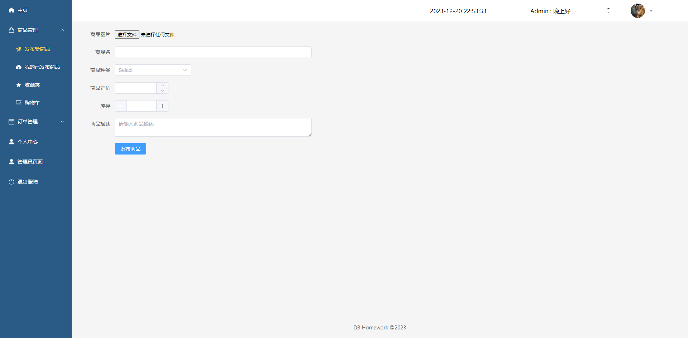

# 一、实现环境和部署方式
本系统是一个 Web 应用，利用 Vue3+Vite+Django 实现分离的前后端。

由于部分依赖的性质，该项目应当部署在全英文路径下。

### 前端

- 整体基于[Vue3](https://www.vue3js.cn/)开发

- UI基于[element-UI](https://element-plus.org/zh-CN/)

- 状态管理基于[Pinia](https://masteringpinia.com/?utm_source=vuerouter&utm_medium=website&utm_campaign=affiliate&utm_content=top_banner&banner_type=top&friend=VUEROUTER)

- 路由管理基于[Vue-router4](https://router.vuejs.org/zh/)

- 启动服务器

  node包管理工具使用pnpm。可以使用常见的npm代替。

  - 使用pnpm作为包管理工具时，通过`pnpm install`安装依赖，然后通过`pnpm dev`启动服务器。

  - 使用npm作为包管理工具时，通过`npm install`安装依赖，然后通过`npm run serve`或`npm run dev`启动服务器。

  默认启动在5173端口下。

### 后端

- 基于Django框架进行开发

- 运行环境：参考requirement.txt或下方

Python：3.11.5

```
asgiref==3.7.2
Django==4.2.7
django-cors-headers==4.3.1
djangorestframework==3.14.0
et-xmlfile==1.1.0
openpyxl==3.1.2
Pillow==10.1.0
PyJWT==2.8.0
pytz==2023.3.post1
sqlparse==0.4.4
tzdata==2023.3
xlrd==2.0.1
```

- 启动服务器

`pip install`安装依赖后，运行`python manage.py runserver`启动服务器。默认启动在8000端口下。

# 二、系统结构
## 2.1 前端
### 2.1.1 文件结构
```
.
├─api
├─assets
│  ├─login
│  ├─product
│  └─user
├─components
│  ├─layout
│  ├─message
│  ├─product
│  ├─promotion
│  ├─statistic
│  ├─timer
│  └─user
├─router
├─stores
│  └─modules
├─utils
└─views
    ├─admin
    │  ├─order
    │  └─user
    ├─home
    ├─layout
    ├─login
    ├─order
    ├─product
    └─user
```
除以下提到的文件外，其余文件均为脚手架生成的冗余文件

- src

  前端的源代码目录

  - api

    前端调用后端实现接口的相关函数。

  - assets

    项目静态文件的存储地址。包括用户和商品的默认头像，网页背景等图片

  - components

    该项目封装的Vue组件。项目依据组件化思想，将可能复用的网页元素模块化为组件并预留插槽，实现了封装

  - router

    路由相关。全局唯一实例化Router，进行配置后导出。全局依托此router设置进行url和页面的对应，并且全局可以导入router并使用路由相关功能。

  - stores

    状态管理相关。状态是pinia定义的概念。可以直观理解为通过调用接口获取的后端返回数据。这些数据被分门别类保存在modules文件夹下的对应文件中，并通过index.js文件统一导出。

  - utils

    工具文件夹。只存在request.js文件，它是对于请求和拦截的封装。项目通过axios发送ajax请求。该项目单独实例化一个新的axios实例并设置它的请求拦截和响应拦截器。在请求拦截中实现Token的附加。在响应拦截中处理是异常状态码的响应，并提示响应的错误信息。

  - views

    页面相关。每个vue文件作为一张网页，分门别类的被存储在各个子文件夹中。

  - App.vue

    Vue框架中挂载到index.html的vue文件。通过`<router-view>`导出当前路由对应的页面

  - main.js

    Vue框架中的入口文件，在此处进行挂载操作和pinia等一系列插件的导入使用。

- index.html

  被挂载的主页。Vue通过将App.vue挂载到该页面进行展示。

- package.json和pnpm-lock.yaml

  项目的依赖文件版本字典。类似于python项目的requirement.txt

- vite.config.js

  vite脚手架的设置。

## 2.2 后端

## 2.3 主要功能
* 用户管理
* 用户注册：允许新用户创建账户，以便在系统中享受更多功能和服务。
* 用户登录：让用户通过输入用户名和密码，进入系统进行操作。
* 用户信息修改：允许用户更新自己的个人资料。
* 用户注销：提供给用户安全退出系统的功能，保护用户隐私。

* 商品管理
* 商品发布：为商家提供发布新商品信息的渠道，以供用户浏览和购买。
* 确定商品类型：帮助商家和管理员分类商品。
* 商品修改：允许商家或管理员对商品信息进行编辑和更新。
* 商品筛选：筛选符合一定条件的商品并展示。
* 商品推荐：推荐商品，提高购物体验。

* 订单管理
* 订单生成：当用户完成商品购买后，系统自动生成订单，记录购买信息。
* 订单修改：允许用户或管理员对订单信息进行编辑和更新，以满足用户需求。
* 订单查询：提供多种查询方式，方便用户和管理员查找订单信息。

* 用户交互
* 评价：让用户对购买的商品进行评价，分享购物心得。
* 留言：提供给用户互相留言的功能，增进用户间的沟通与交流。
* 接收通知：接受系统通知和留言。

* 系统管理
* 修改用户：允许特定管理员对用户进行编辑。
* 修改订单：允许特定管理员对订单进行编辑。

## 2.4 系统功能结构图
# 三、表的定义
## 3.1 基本表，主码外码，完整性约束，索引

### 3.1.1 总览
基本表如下图。


### 3.1.2 表，主码，外码

### 3.1.3 完整性约束

# 四、安全性设计
## 4.1 一般用户权限限制
### 4.1.1 用户注册登录
一般用户需要注册账号才能使用系统的功能。注册时，用户需要提供用户名、密码、邮箱等信息。注册成功后，用户可以使用用户名和密码登录系统。

未登录的用户会自路由引导到登录页面，登录后才能使用系统的功能。
### 4.1.2 用户信息修改
用户可以修改自己的个人信息，包括用户名、密码、邮箱等。

用户可以修改商品信息，但是由验权限制，不能修改其他用户发布的商品信息。
## 4.2 管理员权限限制
### 4.2.1 管理员注册登录
管理员账号必须通过数据库管理员创建，管理员账号的注册和登录与一般用户相同。
### 4.2.2 管理员信息修改
管理员可以修改自己的个人信息，包括用户名、密码、邮箱等。

管理员可以进入特殊的管理页面执行特殊操作，例如删除用户或更改订单状态。
# 五、存储过程触发器与函数
## 5.1 概览
本节涉及的触发器与后端函数依赖关系如下：
```python

urlpatterns = [
    # 用户
    path("register", User.Register.as_view()),
    path("login", User.Login.as_view()),
    path("user", User.GetUserInfo.as_view()),
    path("user/avatar/update", User.AvatarUpdate.as_view()),
    path("user/basicInfor/update", User.BasicInfoUpdate.as_view()),
    path("user/defaultRecInfor/update", User.DefaultRecInforUpdate.as_view()),
    path("user/recInfor/new", User.AddRecInfor.as_view()),
    path("user/recInfor/default", User.GetDefaultRecInfor.as_view()),
    path("user/recInfors", User.GetAllRecInfors.as_view()),

    # 商品
    path("products", Product.GetAllProducts.as_view()),
    path("products/<int:product_id>", Product.GetProduct.as_view()),
    path("products/posted", Product.GetPostedProducts.as_view()),
    path("product/new", Product.PostProduct.as_view()),
    path("product/modify", Product.ProductModify.as_view()),
    path("product/comments/new", Product.AddProductComment.as_view()),
    path("productTypes", Product.GetProductTypes.as_view()),
    path("products/purchase", Product.PurchaseProduct.as_view()),
    # 商品 收藏夹
    path("product/star/switch", Product.ChangeStarStatus.as_view()),
    path("product/star/select", Product.ProductStarSelect.as_view()),
    path("product/star", Product.GetStarredProducts.as_view()),
    # 商品 购物车
    path("product/cart", Product.GetProductsInCart.as_view()),
    path("product/cart/new", Product.AddProductToCart.as_view()),
    path("product/cart/delete", Product.DeleteProductFromCart.as_view()),
    path("product/cart/select", Product.ProductCartSelect.as_view()),
    path("product/cart/modify", Product.CartModify.as_view()),
    path("cart/update/all", Product.CartUpdateAll.as_view()),

    # 订单
    path("order/consumer", Order.GetPurchaseOrder.as_view()),
    path("order/seller", Order.GetSellOrder.as_view()),
    path("order/state/modify", Order.OrderStateModify.as_view()),

    # 管理员
    path("administractor/permission", Administractor.GetIfAdmin.as_view()),
    path("administractor/user/all", Administractor.GetAllUsers.as_view()),
    path("administractor/order/all", Administractor.GetAllOrders.as_view()),
    path("administractor/user/delete", Administractor.DeleteUser.as_view()),
    path("administractor/order/delete", Administractor.DeleteOrder.as_view()),
    path("administractor/users/new", Administractor.UploadUsers.as_view()),
    path("administractor/new", Administractor.AddNewAdministrator.as_view()),
    path("administractor/admin/all", Administractor.AdministratorSelect.as_view()),

    # 统计
    path("product/count", Statistic.GetProductCount.as_view()),
    path("user/active/count", Statistic.GetActiveUserCount.as_view()),
    path("comment/count", Statistic.GetCommentCount.as_view()),
    path("order/active/count", Statistic.GetActiveOrderCount.as_view()),

    # 消息
    path("message/new", Message.SendMessage.as_view()),
    path("message/unread/get", Message.GetUnreadMessage.as_view()),
    path("message/all/get", Message.GetAllMessage.as_view()),
    path("message/unread/query", Message.UnreadMessageQuery.as_view()),

    # 推广
    path("promotion/new", Promotion.RequestPromotion.as_view()),
    path("promotion/update", Promotion.ReceivePromotion.as_view()),
    path("promotion/delete", Promotion.RejectPromotion.as_view()),
    path("promotion/get", Promotion.GetUncheckedPromotion.as_view()),
    path("promotion/active", Promotion.GetActivePromotion.as_view()),


    # test
    # path("uploadfile", Util.UploadFile.as_view()),

    # 访问图片
    re_path(r'media/(?P<path>.*)', serve, {'document_root': settings.MEDIA_ROOT}),
    # re_path(r'^media/(?P<path>.*)$', utils.serve_media),
]
```

# 六、系统主要模块和源码
6.1 至 6.3 展示了前端的主要逻辑和相应代码。6.4 至 6.5 展示了后端的主要逻辑和相应代码。

前一节给出的存储过程触发器与函数对应的代码不再重复。
## 6.1 前端-api
前端的 api 提供了前后端之间发送请求的接口。
### 6.1.1 用户api
```javascript
import request from '@/utils/request'

// 注册
export const userRegisterService = ({ userName, email, password }) =>
  request.post('/register', { userName, email, password })

// 登录
export const userLoginService = ({ userName, password }) =>
  request.post('/login', { userName, password })

// 获取用户基本信息
export const userGetInfoService = () => request.get('/user')

// 更新用户基本信息
export const userUpdateInfoService = (email) =>
  request.post('/user/basicInfor/update', { email })

// 更新用户头像 avatar为FormData
export const userUpdateAvatarService = (avatar) =>
  request.post('user/avatar/update', avatar, {
    headers: { 'Content-Type': 'multipart/form-data' }
  })

// 用户新建收货信息
export const userCreateRecInfoService = ({ recName, phone, place }) =>
  request.post('/user/recInfor/new', {
    name: recName,
    phone: phone,
    place: place
  })
// 用户设置默认收货信息
export const userSetDefaultRecInfoService = ({ id }) =>
  request.post('/user/defaultRecInfor/update', { id })

// 用户获取自己的默认收货地址
export const userGetDefaultRecInforService = () =>
  request.get('/user/recInfor/default')

// 用户获取自己的所有收货地址
export const userGetAllRecInforService = () => request.get('/user/recInfors')

// 更新用户密码
export const userUpdatePasswordService = ({ old_pwd, new_pwd, re_pwd }) =>
  request.patch('/my/updatepwd', { old_pwd, new_pwd, re_pwd })

// 上传用户清单批量添加用户
export const userUploadExcelService = (file) =>
  request.post('/administractor/users/new', file, {
    headers: { 'Content-Type': 'multipart/form-data' }
  })

// 获取所有用户信息(管理员)
export const userGetAllUserService = () =>
  request.get('/administractor/user/all')

// 删除用户(管理员)
export const userDeleteUserService = ({ userName }) =>
  request.post('/administractor/user/delete', { userName })

// 将用户添加为管理员
export const userAddAdminService = ({ userName }) =>
  request.post('/administractor/new', { userName })

// 获取所有管理员信息
export const userGetAllAdminService = () =>
  request.get('/administractor/admin/all')
```

```javascript
import request from '@/utils/request'
// 注意箭头函数加了括号记得return

// 获取用户所有特定订单信息
export const orderGetSeller = () => request.get('/order/seller')
export const orderGetConsumer = () => request.get('/order/consumer')

// 获取所有订单信息
export const orderGetAllService = () => request.get('/administractor/order/all')

// 修改订单状态
export const orderChangeStateService = ({ id, state }) =>
  request.post('/order/state/modify', { id, state })

// 管理员删除订单
export const orderDeleteOrderService = ({ id }) =>
  request.post('/administractor/order/delete', { id })
```

### 6.1.2 计数
```javascript
import request from '@/utils/request'

// 获取当前活跃用户数
export const statisticGetActiveUserService = () =>
  request.get('/user/active/count')

// 获取当前在售商品
export const statisticGetProductCountService = () =>
  request.get('/product/count')

// 获取当前评论总数
export const statisticGetCommentCountService = () =>
  request.get('/comment/count')

// 获取当前活跃订单
export const statisticGetActiveOrderCountService = () =>
  request.get('/order/active/count')

```

### 6.1.3 评论
```javascript
import request from '@/utils/request'

// 提交评论内容
export const commentSubmitService = ({ commentText, productId }) =>
  request.post('/product/comments/new', { commentText, productId })

```

### 6.1.4 消息
```javascript
import request from '@/utils/request'

// 给其他用户发送私信
export const messageNewService = ({ userName, content }) =>
  request.post('/message/new', { userName, content })

// 用户获取自己的未读消息
export const messageGetUnreadService = () => request.get('/message/unread/get')

// 用户获取自己的所有信息
export const messageGetAllService = () => request.get('/message/all/get')

// 用户查询自己是否有已读消息
export const messageQueryUnreadService = () =>
  request.get('/message/unread/query')

```

### 6.1.5 推广
```javascript
import request from '@/utils/request'

// 用户请求推广自己的商品
export const promotionNewService = ({ productId }) =>
  request.post('/promotion/new', { productId })

// 管理员接受推广申请
export const promotionUpdateService = ({ productId }) =>
  request.post('/promotion/update', { productId })

// 管理员拒绝推广申请并发信
export const promotionDeleteService = ({ productId }) =>
  request.post('/promotion/delete', { productId })

// 管理员获取推广申请列表
export const promotionGetAllService = () => request.get('/promotion/get')

// 获取当前的推广申请列表
export const promotionGetActiveService = () => request.get('/promotion/active')

```

### 6.1.6 管理员权限
```javascript
import request from '@/utils/request'

// 判断管理员权限
export const permissionJudgeAdminService = () =>
  request.get('/administractor/permission')

```
## 6.2 前端-router
前端的路由解析负责处理网址并展示页面。

用户和管理员是否有权限访问特定页面，也在此判断。
```javascript
import { createRouter, createWebHistory } from 'vue-router'
import { useUserStore } from '@/stores'
import { permissionJudgeAdminService } from '@/api/permission'
import { ElMessage } from 'element-plus'
const router = createRouter({
  history: createWebHistory(import.meta.env.BASE_URL),
  routes: [
    {
      path: '/login',
      component: () => import('@/views/login/LoginPage.vue')
    },
    {
      path: '/',
      component: () => import('@/views/layout/LayoutContainer.vue'),
      redirect: '/home',
      children: [
        {
          path: '/home',
          component: () => import('@/views/home/HomePage.vue')
        },
        {
          path: '/user/profile',
          component: () => import('@/views/user/UserProfile.vue')
        },
        {
          path: '/user/message',
          component: () => import('@/views/user/UserMessage.vue')
        },
        {
          path: '/product/:id',
          component: () => import('@/views/product/ProductDetail.vue')
        },
        {
          path: '/product/new',
          component: () => import('@/views/product/ProductNew.vue')
        },
        {
          path: '/product/posted',
          component: () => import('@/views/product/ProductPosted.vue')
        },
        {
          path: '/product/:id/modify',
          component: () => import('@/views/product/ProductModify.vue')
        },
        {
          path: '/product/star',
          component: () => import('@/views/product/ProductStar.vue')
        },
        {
          path: '/product/cart',
          component: () => import('@/views/product/ProductCart.vue')
        },
        {
          path: '/order/consumer',
          component: () => import('@/views/order/Consumer.vue')
        },
        {
          path: '/order/seller',
          component: () => import('@/views/order/Seller.vue')
        }
      ]
    },
    {
      path: '/admin',
      component: () => import('@/views/admin/AdminLayoutContainer.vue'),
      redirect: '/admin/home',
      children: [
        {
          path: '/admin/home',
          component: () => import('@/views/admin/AdminHomePage.vue')
        },
        {
          path: '/admin/user/new',
          component: () => import('@/views/admin/user/UserNew.vue')
        },
        {
          path: '/admin/user/list',
          component: () => import('@/views/admin/user/UserList.vue')
        },
        {
          path: '/admin/admin/list',
          component: () => import('@/views/admin/user/AdminList.vue')
        },
        {
          path: '/admin/order',
          component: () => import('@/views/admin/order/Order.vue')
        }
      ]
    }
  ]
})

router.beforeEach(async (to, from) => {
  // 如果没有token, 且访问的是非登录页，拦截到登录页，其他情况正常放行
  const userStore = useUserStore()
  if (!userStore.token && to.path !== '/login') return '/login'
  // // 如果当前商品不是用户创建的, 用户不能访问该商品的修改信息页
  // const productStore = useProductStore()
  // if (!productStore.postProductList && )
  if (to.path === '/admin/home') {
    const res = await permissionJudgeAdminService()
    console.log(res.data.data.ifAdmin)
    if (res.data.data.ifAdmin === false) {
      ElMessage.error('您没有管理员权限')
      return '/home'
    }
  }
})

export default router

```
## 6.3 前端-外观
前端该部分代码较为冗长，暂不贴出。

每个页面有相应视图，每个视图的外观由若干组件和其他内容构成。

视图，组件分别位于`src/views`，`src/components`。
## 6.4 后端-数据模型
这是后端对数据模型类的定义。
```python
from datetime import timedelta

from django.db import models

EMAIL_LEN = 30
NAME_LEN = 10
PASSWD_LEN = 50
PHONE_LEN = 30
PLACE_LEN = 100
PRODUCT_MAME_LEN = 50
DESCRIPTION_LEN = 200


# Create your models here.
class User(models.Model):
    email = models.CharField(max_length=EMAIL_LEN, verbose_name='email')
    name = models.CharField(max_length=NAME_LEN, verbose_name='姓名', primary_key=True)
    password = models.CharField(max_length=PASSWD_LEN, verbose_name='密码')
    currentInfo = models.ForeignKey('UserInfo', on_delete=models.CASCADE, null=True, blank=True,
                                    related_name='current')
    avatar = models.ForeignKey('Images', null=True, on_delete=models.SET_NULL, default=None)
    register_time = models.DateTimeField(auto_now_add=True)

    def get_register_time(self):
        time = self.register_time.strftime('%Y-%m-%d %H:%M:%S')
        return time

    class Meta:
        db_table = 'users'  # 指明数据库表名

    def __str__(self):
        """定义每个数据对象的显示信息"""
        return self.name


class Administrator(models.Model):
    user = models.ForeignKey(User, on_delete=models.CASCADE)
    level = models.IntegerField()


class UserInfo(models.Model):
    user = models.ForeignKey(User, on_delete=models.CASCADE)
    # userInfo_id = models.IntegerField()
    name = models.CharField(max_length=NAME_LEN, verbose_name='收货人姓名')
    phone = models.CharField(max_length=PHONE_LEN, verbose_name='收货人手机号')
    place = models.CharField(max_length=PLACE_LEN, verbose_name='收货地址')

    class Meta:
        db_table = 'adder_info'
        # unique_together = (("user", "userInfo_id"),)

    def __str__(self):
        return self.name


class ProductType(models.Model):
    type = models.CharField(max_length=100)
    fatherType = models.ForeignKey('ProductType', null=True, blank=True, on_delete=models.CASCADE)

    class Meta:
        db_table = 'product_type'

    def __str__(self):
        return self.type


class Product(models.Model):
    publisher = models.ForeignKey(User, on_delete=models.CASCADE)
    product_name = models.CharField(max_length=PRODUCT_MAME_LEN, verbose_name='商品')
    price = models.FloatField()
    description = models.CharField(max_length=DESCRIPTION_LEN, verbose_name='描述')
    sale = models.IntegerField(default=0)
    stock = models.IntegerField()
    post_time = models.DateTimeField(auto_now_add=True)
    product_type = models.ForeignKey(ProductType, null=True, blank=True, on_delete=models.CASCADE)

    def get_create_time(self):
        time = self.post_time.strftime('%Y-%m-%d %H:%M:%S')
        return time

    class Meta:
        db_table = 'product'

    def __str__(self):
        return self.product_name


class Favorite(models.Model):
    user = models.ForeignKey(User, on_delete=models.CASCADE)
    product = models.ForeignKey(Product, on_delete=models.CASCADE)

    class Meta:
        db_table = 'favorite'
        unique_together = (("user", "product"),)

    # def __str__(self):
    #     return self.user, self.product


class Cart(models.Model):
    user = models.ForeignKey(User, on_delete=models.CASCADE)
    product = models.ForeignKey(Product, on_delete=models.CASCADE)
    count = models.IntegerField()
    create_time = models.DateTimeField(auto_now_add=True)    # 加入购物车的时间

    def get_create_time(self):
        time = self.create_time.strftime('%Y-%m-%d %H:%M:%S')
        return time

    class Meta:
        db_table = 'cart'
        unique_together = (("user", "product"),)

    # def __str__(self):
    #     return self.user, self.product


class Order(models.Model):
    buyer = models.ForeignKey(User, models.SET_NULL, blank=True, null=True)
    product = models.ForeignKey(Product, models.SET_NULL, blank=True, null=True)
    buyer_name = models.CharField(max_length=NAME_LEN)
    product_name = models.CharField(max_length=PRODUCT_MAME_LEN)
    seller_name = models.CharField(max_length=NAME_LEN)
    number = models.IntegerField()
    create_time = models.DateTimeField(auto_now_add=True)
    status = models.CharField(max_length=20, default="ToBeShipped")
    price = models.FloatField()
    receiver_name = models.CharField(max_length=NAME_LEN, verbose_name='收货人姓名', default="")
    receiver_phone = models.CharField(max_length=PHONE_LEN, verbose_name='收货人手机号', default="")
    receiver_place = models.CharField(max_length=PLACE_LEN, verbose_name='收货地址', default="")

    def get_create_time(self):
        time = self.create_time.strftime('%Y-%m-%d %H:%M:%S')
        return time

    class Meta:
        db_table = 'order'

    def __str__(self):
        return self.buyer_name, self.product_name


class Comment(models.Model):
    publisher = models.ForeignKey(User, on_delete=models.CASCADE)
    item = models.ForeignKey(Product, on_delete=models.CASCADE)
    text = models.TextField()
    create_time = models.DateTimeField(auto_now_add=True)

    def get_create_time(self):
        time = self.create_time.strftime('%Y-%m-%d %H:%M:%S')
        return time

    class Meta:
        db_table = 'comment'

    def __str__(self):
        return self.text


class Message(models.Model):
    sender = models.ForeignKey(User, models.SET_NULL, blank=True, null=True, related_name='Message_sender')
    recipient = models.ForeignKey(User, models.SET_NULL, blank=True, null=True, related_name='Message_recipient')
    senderName = models.CharField(max_length=NAME_LEN)
    recipientName = models.CharField(max_length=NAME_LEN)
    content = models.TextField()
    status = models.CharField(max_length=20, default='unread')

    class Meta:
        db_table = 'message'


class Promotion(models.Model):
    applicant = models.ForeignKey(User, on_delete=models.CASCADE)
    product = models.ForeignKey(Product, on_delete=models.CASCADE)
    begin_time = models.DateTimeField(blank=True, null=True)
    length = models.IntegerField(default=5)         # 以分为单位
    is_checked = models.BooleanField(default=False)

    def get_end_time(self):
        end_time = self.begin_time + timedelta(minutes=self.length)
        return end_time

    class Meta:
        db_table = 'promotion'


class Images(models.Model):
    img = models.ImageField(upload_to='images', default='')
    # img = models.ImageField(upload_to=get_file_path, default='')

    def get_url(self):
        img_path = "" if self.img == '' else ('http://127.0.0.1:8000/media/images/'
                                              + str(self.img.name).split('/')[-1])
        return img_path

    class Meta:
        db_table = 'images'


class ProductImages(models.Model):
    img = models.ForeignKey(Images, on_delete=models.CASCADE)
    product = models.ForeignKey(Product, on_delete=models.CASCADE)

    class Meta:
        db_table = 'product_images'


```
## 6.5 后端-其他功能模块
图片序列化
```python
from rest_framework import serializers


class NewsImgUploadSerializer(serializers.Serializer):

    img = serializers.ImageField(
        label="图片",
        max_length=256,   # 图片名最大长度
        use_url=True,     # 设为True则URL字符串值将用于输出表示,设为False则文件名字符串值将用于输出表示
        error_messages={
            'invalid': '图片参数错误'
        }
    )

```
token处理，媒体资源管理
```python
import os
from datetime import datetime

import jwt
from django.views.static import serve
from rest_framework.request import Request

from backend import settings

SECRET_KEY = 'awsfdf'


def gen_token(name: str):
    dict = {
        'username': name
    }
    token = jwt.encode(dict, SECRET_KEY, algorithm='HS256')
    return token


def get_header_token(req: Request):
    if req.headers.get('Authorization'):
        #vprint(req.headers['token'])
        return req.headers['Authorization'][7:]


def decode_token(token):
    try:
        dict = jwt.decode(token, SECRET_KEY, algorithms=['HS256'])
    except jwt.ExpiredSignatureError:
        return None
    except jwt.InvalidTokenError:
        return None
    except Exception:
        return None
    return dict


def serve_media(request, path):
    return serve(request, path, document_root=settings.MEDIA_ROOT)


def image_upload_path(instance, filename):
    # 获取当前日期和时间
    current_time = datetime.now()
    # 获取文件的扩展名
    ext = os.path.splitext(filename)[1]
    # 构造新的文件名，例如：image_20211124_120000.png
    new_filename = f"image_{current_time.strftime('%Y%m%d_%H%M%S')}{ext}"
    # 返回文件的存储路径
    return os.path.join('images', new_filename)

```

# 七、运行验证

## 7.1 用户行为

### 7.1.1 登录

登录页


用户名密码的限制


错误的账号密码


### 7.1.2 注册

### 7.1.3 商品创建

主页


创建商品



发布商品


所发布商品修改


浏览商品详情

### 7.1.4 商品行为


加入购物车/收藏


收藏夹/购物车


未设定收货地址的结算


设定收货地址后的结算


### 7.1.5 用户信息

设定收货地址
设定默认收获地址
编辑用户信息

### 7.1.6 订单行为

卖方发货，推进进度
买方收货，完成订单
查看订单

## 7.1.7 管理员

访问权限控制
订单操作
用户编辑
管理员编辑


# 八、收获与体会
