| 学生姓名 | 主要任务                                     | 工作量占比 |
| -------- | -------------------------------------------- | ---------- |
| 路涛     | 前端功能的实现、开发流程设计、前后端联调测试 | 33.3%      |
| 王静     | 后端功能的实现、前后端联调测试               | 33.3%      |
| 钟彦童   | 文档的书写、前后端联调测试                   | 33.3%      |

# 一、需求分析

## 1.1 项目背景
随着互联网技术的快速发展和智能手机的普及，人们的生活方式发生了巨大变化。其中之一就是在线交易平台的兴起，尤其是在校学生中，对于二手交易的的需求日益增长。因此，设计一个基于学校的P2P交易平台是非常必要的。

学校是一个庞大的社区，大家每天都在进行着大量的交易活动。然而，传统的二手交易方式存在很多问题，比如信息不对称、交易不便等。而通过建立一个平台，可以有效地解决这些问题。

我们设计 **MyGO**（**My Goods Online**） 平台，旨在为学校内的学生和教师提供一个安全、便捷、高效的二手交易环境。在这个平台上，用户可以轻松发布自己想要的商品信息，也可以查看其他用户发布的商品信息，并进行交易。同时，平台还提供了一系列的推荐，订单处理，安全保障等功能，以确保交易的顺利进行。
## 1.2 功能需求
### 1.2.1 用户管理
* 用户注册
* 用户登录
* 用户信息修改
* 用户注销
### 1.2.2 商品管理
* 商品发布
* 确定商品类型
* 商品修改
* 商品筛选
* 商品推荐
### 1.2.3 订单管理
* 订单生成
* 订单修改
* 订单查询
### 1.2.4 用户交互
* 评价
* 留言
* 接收通知
### 1.2.5 系统管理
* 修改用户
* 修改订单
## 1.3 数据流图
数据流图共三层，总体结构如下：

### 1.3.1 顶层数据流图

### 1.3.2 次级数据流图

本层数据流图省略了对平台管理员Level 1 权限检查的过程。管理员对各表的特殊操作都有权限检查的过程。

### 1.3.3 用户数据流

用户信息：

发消息：

展示商品：

购买商品：

发布推广：

### 1.3.4 管理员数据流

管理员权限设置和取消：

以下Level1权限信息均来自管理员表的权限判断。

增删用户：

删除订单，修改订单状态：

审核推广：

## 1.4 数据元素表

User:
| 名字 | 含义 | 类型 | 主键 | 外键 |
| --- | --- | --- | --- | --- |
| email | 邮箱 | varchar | False | False |
| name | 姓名 | varchar | True | False |
| password | 密码 | varchar | False | False |
| currentInfo_id | 当前信息 | int      | False | True |
| avatar_id | 头像 | int | False | True |
| register_time | 注册时间 | datetime | False | False |

Administrator:

| 名字    | 含义       | 类型 | 主键  | 外键  |
| ------- | ---------- | ---- | ----- | ----- |
| user_id | 用户id     | int  | False | True  |
| level   | 管理员等级 | int  | False | False |

UserInfo:

| 名字 | 含义 | 类型 | 主键 | 外键 |
| --- | --- | --- | --- | --- |
| id | 收货信息id | int | True | False |
| name | 收货人姓名 | varchar | False | False |
| phone | 收货人手机号 | varchar | True | False |
| place | 收货地址 | varchar | True | False |

ProductType:
| 名字 | 含义 | 类型 | 主键 | 外键 |
| --- | --- | --- | --- | --- |
| id | 商品类型id | int | True | False |
| type | 类型 | varchar | False | False |
| fatherType_id | 父类型 | int     | False | True |

Product:
| 名字 | 含义 | 类型 | 主键 | 外键 |
| --- | --- | --- | --- | --- |
| id | 商品id | int | True | False |
| publisher_id | 发布者 | int | False | True |
| product_name | 商品名称 | varchar | False | False |
| price | 价格 | float | False | False |
| description | 描述 | varchar | False | False |
| sale | 销量 | int | False | False |
| stock | 库存 | int | False | False |
| post_time | 发布时间 | datetime | False | False |
| product_type | 商品类型 | int      | False | True |

Favorite:
| 名字 | 含义 | 类型 | 主键 | 外键 |
| --- | --- | --- | --- | --- |
| id | 收藏夹项id | int | True | False |
| user_id | 用户 | int  | False | True  |
| product_id | 商品 | int | False | True  |

Cart:
| 名字 | 含义 | 类型 | 主键 | 外键 |
| --- | --- | --- | --- | --- |
| id | 购物车项id | int | True | False |
| user_id | 用户 | int | False | True  |
| product_id | 商品 | int | False | True |
| count | 加购数量 | int | False | False |
| create_time | 加入购物车时间 | varchar | False | False |

Order:
| 名字 | 含义 | 类型 | 主键 | 外键 |
| --- | --- | --- | --- | --- |
| id | 订单id | int | True | False |
| buyer_id | 买家 | int | False | True |
| product_id | 商品 | int | False | True |
| buyer_name | 买家姓名 | varchar | False | False |
| product_name | 商品名称 | varchar | False | False |
| seller_name | 卖家姓名 | varchar | False | False |
| number | 数量 | int | False | False |
| create_time | 创建时间 | datetime | False | False |
| status | 订单状态 | varchar | False | False |
| receiver_name | 收货人姓名 | varchar | False | False |
| receiver_phone | 收货人手机号 | varchar | False | False |
| receiver_place | 收货地址 | varchar | False | False |

Comment:
| 名字 | 含义 | 类型 | 主键 | 外键 |
| --- | --- | --- | --- | --- |
| id | 评论id | int | True | False |
| publisher_id | 发布者 | int      | False | True |
| item_id | 商品 | int | False | True |
| text | 文本 | text | False | False |
| create_time | 创建时间 | datetime | False | False |

Message:
| 名字 | 含义 | 类型 | 主键 | 外键 |
| --- | --- | --- | --- | --- |
| id | 消息id | int | True | False |
| sender_id | 发送者 | int | False | True |
| recipient_id | 接收者 | int | False | True |
| senderName | 发送者姓名 | varchar | False | False |
| recipientName | 接收者姓名 | varchar | False | False |
| content | 内容 | text | False | False |
| status | 状态 | varchar | False | False |

Promotion:
| 名字 | 含义 | 类型 | 主键 | 外键 |
| --- | --- | --- | --- | --- |
| id | 推广id | int | True | False |
| applicant_id | 申请人 | int | False | True |
| product_id | 商品 | int | False | True |
| begin_time | 开始时间 | datetime | False | False |
| length | 时长 | int | False | False |
| is_checked | 是否审核 | boolean | False | False |

ProductImages:
| 名字 | 含义 | 类型 | 主键 | 外键 |
| ------------ | ------------ | --------- | -------------- | ------------- |
| product_id | 商品id | int | False | True |
| img_id      | 图片id | int  | False     | True        |
# 二、概念模式
## 2.1 E-R图

# 三、逻辑模式
## 3.1 关系模式
1. **users** (<u>name</u>, email, password, currentInfo, avatar_id, regieter_time);
2. **images** (<u>id</u>, img);
3. **adder_info** (<u>id</u>, name, phone, place, user_id);
4. **product** (<u>id</u>, product_name, description, sale, stock, publisher_id, product_type_id, post_time, price);
5. **product_type** (<u>id</u>, type, fatherType);
6. **product_images** (<u>id</u>, img_id, product_id);
7. **app_administrator** (<u>id</u>, level, user_id);
8. **order** (<u>id</u>, number, create_time, buyer_id, receiver_name, receiver_phone, receiver_place, status, buyer_name, product_name, seller_name, price);
9. **cart** (<u>id</u>, product_id, user_id, count, create_time);
10. **favorite** (<u>id</u>, product_id, user_id);
11. **comment** (<u>id</u>, text, create_time, item_id, publisher_id);
12. **message** (<u>id</u>, senderName, recipientName, content, recipient_id, sender_id, status);
13. **promotion** (<u>id</u>, length, is_checked, applicant_id, product_id, begin_time);

## 3.2 规范化到3NF
由于每个表的属性都是原子的，故而每个表都满足 1NF。由于每个表的主码都仅为 id 或 name，故而不存在部分依赖，所以每个表都满足 2NF。

以下分析 3NF。

1. 用户 **users** (<u>name</u>, email, password, currentInfo, avatar_id, regieter_time);
> currentInfo: 收货信息外码  
> avatar_id: 图片外码  
> 主属性：name, email  

password, currentInfo, avatar_id, regieter_time 都直接依赖于 name，且不存在互相依赖，故而满足 3NF。

2. 图片 **images** (<u>id</u>, img);
> 主属性：id  

img 直接依赖于 id，满足 3NF。

3. 收货信息 **adder_info** (<u>id</u>, name, phone, place, user_id);
> user_id: 用户外码  
> 主属性：id  

name, phone, place 直接依赖于 id，且不存在互相依赖，故而满足 3NF。

4. 商品 **product** (<u>id</u>, product_name, description, sale, stock, publisher_id, product_type_id, post_time, price);
> publisher_id: 用户外码  
> product_type_id: 商品类别外码  
> 主属性：id  

product_name, description, sale, stock, publisher_id, product_type_id, post_time, price 都直接依赖于 id，且不存在互相依赖，故而满足 3NF。

5. 商品类别 **product_type** (<u>id</u>, type, fatherType);
> fatherType: 类别外码  
> 主属性：id, type  

type 和 id 互相依赖，不构成传递依赖问题，故而满足 3NF。

6. 商品图 **product_images** (<u>id</u>, img_id, product_id);
> img_id: 图片外码  
> product_id: 商品外码  
> 主属性：id, img_id  

id 和 img_id 互相依赖，不构成传递依赖问题，故而满足 3NF。

7. 管理员 **app_administrator** (<u>id</u>, level, user_id);
> user_id: 用户外码  
> 主属性：id, user_id  

id 和 user_id 互相依赖，不构成传递依赖问题，故而满足 3NF。

8. 订单 **order** (<u>id</u>, number, create_time, buyer_id, product_id, receiver_name, receiver_phone, receiver_place, status, buyer_name, product_name, seller_name, price);
> buyer_id: 用户外码  
> product_id: 商品外码  
> status: 订单状态  
> 主属性：id  

要注意，任意多个用户可以购买任意多个商品任意多次，故而订单表的候选码为 id。

本表中的交易信息需要特殊的快照机制：
* price 是成交价格，不能通过 product 表的当前定价获取。
* receiver_name, receiver_phone, receiver_place 是成交时的收货信息，不能通过 user 表的当前收货信息获取。
* buyer_name, product_name, seller_name 是用户和商品名称的快照，在删除用户或商品时需要保留，不能通过 user 表和 product 表的对象获取。
* buyer_id, product_id 在删除用户或商品时需要置空，拒绝跳转访问。同时也避免删除后新创建的同名用户错误继承订单信息。不能使用 product_name, buyer_name, 代替。
* number 是成交个数，不能通过 id 获取。create_time 是订单创建时间，不能通过 id 获取。status 是订单状态，不能通过 id 获取。

综上所述 number, create_time, buyer_id, product_id, receiver_name, receiver_phone, receiver_place, status, buyer_name, product_name, seller_name, price 都直接依赖于 id，且不存在互相依赖，故而满足 3NF。

9. 购物车 **cart** (<u>id</u>, product_id, user_id, count, create_time);
> product_id: 商品外码  
> user_id: 用户外码  
> 主属性：id, user_id  

id 和 user_id 互相依赖，不构成传递依赖问题。product_id, count, create_time 都直接依赖于 id，且不存在互相依赖。故而满足 3NF。

10. 收藏 **favorite** (<u>id</u>, product_id, user_id);
> product_id: 商品外码  
> user_id: 用户外码  
> 主属性：id, user_id  

id 和 user_id 互相依赖，不构成传递依赖问题。product_id 都直接依赖于 id，且不存在互相依赖。故而满足 3NF。

11. 评论 **comment** (<u>id</u>, text, create_time, item_id, publisher_id);
> item_id: 商品外码  
> publisher_id: 用户外码  
> 主属性：id  

要注意，任意多个用户可以对任意多个商品进行任意次评论，故而评论表的候选码为 id。

text, create_time, item_id, publisher_id 都直接依赖于 id，且不存在互相依赖，故而满足 3NF。

12. 消息 **message** (<u>id</u>, senderName, recipientName, content, recipient_id, sender_id, status);
> recipient_id: 用户外码  
> sender_id: 用户外码  
> 主属性：id  

要注意，任意多个用户可以给任意多个用户发送任意多次消息，故而消息表的候选码为 id。

本表中的消息信息需要特殊的快照机制：
* senderName, recipientName 是用户名称的快照，在删除用户时需要保留，不能通过 user 表的对象获取。
* recipient_id, sender_id 在删除用户时需要置空，拒绝跳转访问。同时也避免删除后新创建的同名用户错误继承消息信息。不能使用 senderName, recipientName 代替。

综上所述 senderName, recipientName, content, recipient_id, sender_id, status 都直接依赖于 id，且不存在互相依赖，故而满足 3NF。

13. 推广 **promotion** (<u>id</u>, length, is_checked, applicant_id, product_id, begin_time);
> applicant_id: 用户外码  
> product_id: 商品外码  
> 主属性：id  

要注意，任意多个用户可以申请任意多个商品进行任意次推广，故而推广表的候选码为 id。

本表中的推广信息需要特殊的快照机制：

* applicant_id 在删除用户时需要置空，拒绝跳转访问。同时也避免删除后新创建的同名用户错误继承推广信息，不能通过 product 表的对象获取。

length, is_checked, applicant_id, product_id, begin_time 都直接依赖于 id，且不存在互相依赖，故而满足 3NF。

由以上可知：这些表都至少满足 3NF。